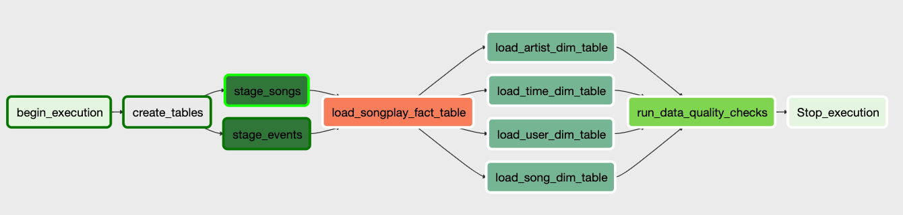

# Data pipelines with Airflow

## About
The files within this repository schedule processing of song- and log data found in the context of a music-streaming 
service (Sparkify) using Apache [Airflow](https://airflow.apache.org). After target tables have been created, data 
stored in AWS S3 buckets in JSON-format is loaded into staging tables. Once data has been loaded, the remaining fact 
and dimension tables are filled with data from the staging tables.

## Prerequisites
* AWS account with dedicated user including access key ID and secret access key
* Access to a (running) AWS Redshift cluster, where access means:
    - Having created an attached a security group allowing access on port 5439
    - Having created an attached a role allowing Redshift to access buckets on AWS S3
 * Working installation of Airflow, where working means:
    - Airflow web server and scheduler are running
    - Connection to AWS is set up using `aws_default` ID
    - Connection to Redshift is set up using `redshift_default` ID
    - AWS IAM role is set up as Airflow variable using `aws_iam_role` as key
 * Unix-like environment (Linux, macOS, WSL on Windows)

## Usage
1. Clone this repository and navigate into the _airflow_ directory
2. Copy all directories and files (dags, operators, sql) into your _AIRFLOW_ home directory or use the `--subdir` 
parameter when executing the following commands from the CLI
3. Verify that the sparkify_dag has been correclty parsed by Airflow via `airflow list_tasks sparkify_dag --tree`
4. Trigger a DAG run via `airflow trigger_dag sparkify_dag`. If just want to run a specific task do so via
`airflow run -i sparkify_dag <task_id>`

## Limitations
* The custom `StageToRedshiftOperator` could probably replaced by the build-in 
[S3toRedshiftTransfer](https://airflow.apache.org/_api/airflow/operators/s3_to_redshift_operator/index.html)
* The `DataQualityOperator` currently only checks if data has been loaded into tables

## Resources
* [Airflow documentation](https://airflow.apache.org/index.html)
* [Blog post on several, potentially unpopular, Airflow features](https://medium.com/datareply/airflow-lesser-known-tips-tricks-and-best-practises-cf4d4a90f8f)
* [Blog post on developing Airflow components using PyCharm](http://michal.karzynski.pl/blog/2017/03/19/developing-workflows-with-apache-airflow/)
