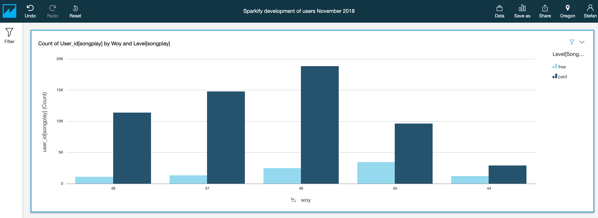

# Data warehousing with Amazon Redshift

## About
The scripts within this repository perform ELT (extract, load, transform) for song- and log data found in the context of
a music-streaming service (Sparkify). After target tables have been created (c.f. ```create_tables.py```), data stored 
in AWS S3 buckets in JSON-format is loaded into staging tables (c.f. ```etl.py```). Once data has been loaded, the 
remaining fact and dimension tables are filled with data from the staging tables (c.f. ```sql_queries.py```).

In order to conveniently analyze the data loaded into Redshift check out 
[AWS QuickSight](https://aws.amazon.com/quicksight/).  



## Prerequisites
* Access to an (running) [AWS Redshift](https://aws.amazon.com/redshift) instance reachable from the internet - 
including a corresponding [AWS IAM role](https://docs.aws.amazon.com/IAM/latest/UserGuide/id_roles.html)
* Create/drop/insert/update rights for the Redshift instance
* Python 3.6+
* Python package psycopg2
* Unix-like environment (Linux, macOS, WSL on Windows)

## Usage
Edit ```dwh.cfg``` and enter the your information in the corresponding sections (CLUSTER and IAM_ROLE)  
Create all required tables - tables will be dropped if the already exist
```
python create_tables.py
```
Load data from S3 buckets into staging tables and once done, fill fact and dimension tables accordingly
```
python etl.py
````

## Limitations
* There exists no [Ansible](https://www.ansible.com) script to create Redshift cluster and IAM-role automatically yet

## Resources
* [Redshift data loading tutorial](https://docs.aws.amazon.com/redshift/latest/dg/tutorial-loading-data.html)
* [Redshift supported datatypes](https://docs.aws.amazon.com/redshift/latest/dg/c_Supported_data_types.html)
* [Unsupported PostgreSQL functions in Redshift](https://docs.aws.amazon.com/redshift/latest/dg/c_unsupported-postgresql-features.html)
* [Redshift COPY command](https://docs.aws.amazon.com/redshift/latest/dg/copy-parameters-data-load.html)
* [Redshift DATETIME functions](https://docs.aws.amazon.com/redshift/latest/dg/r_Dateparts_for_datetime_functions.html)
* [Redshift EXTRACT function](https://docs.aws.amazon.com/redshift/latest/dg/r_EXTRACT_function.html)
* [Authorizing QuickSight connections to Redshift](https://docs.aws.amazon.com/quicksight/latest/user/enabling-access-redshift.html)
* [Udacity knowledge portal](https://knowledge.udacity.com/)
* [Ansible user guide](https://docs.ansible.com/ansible/latest/user_guide/index.html)